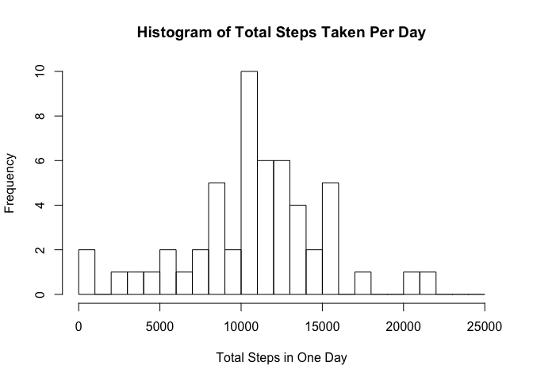
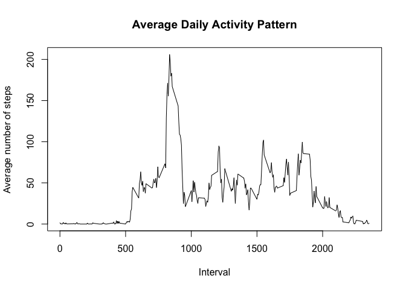
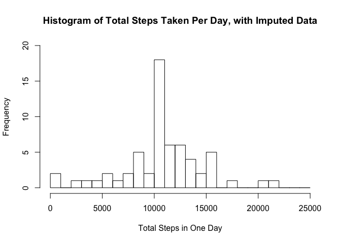
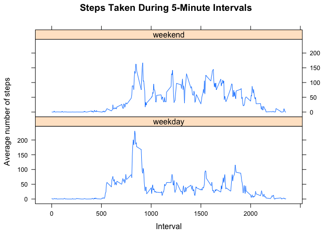

# Reproducible Research: Peer Assessment 1
Report on Activity Tracker Data
===============================

Kristin Abkemeier, October 2017

This assignment entails analyzing data from a personal activity monitoring device such as a Fitbit or a Jawbone Up that collects data on the device's movement at five-minute intervals through out the day. The data set we analyze here consists of two months of data from an anonymous individual collected during the months of October and November, 2012, and include the number of steps that the individual took during each interval. The intervals are numbered by 24-hour and minute (hence, interval "55" is directly followed by "100").

For this report, we read in the data contained in the file activity.csv.


```r
## Loading and preprocessing the data
options(scipen = 1, digits = 2)
setwd("/Users/kristinabkemeier/DataScience/Reproducibility Research - Project 1")
fig.path='/figures/'
data <- read.csv("activity.csv", header=TRUE)
library(dplyr)
data %>% mutate_if(is.factor, as.character) -> data
```

We need to convert the values in data\$date from factors to strings. Otherwise, the dates that are not included once we strip out the NA values from data\$steps will appear as having zero steps taken. Including those dates with zero steps will throw off the calculation of the mean and median values, because it is extremely unlikely that someone who wears an activity tracker would take zero steps during a 24-hour period.

So, we need to remove the NA values to find the mean total number of steps taken per day.
Then we use split() to bin the data by date and then sapply() with sum to add up the total steps for each date. Finally, we plot a histogram.

```r
## What is mean total number of steps taken per day?
dataCleaned <- data[which(!is.na(data$steps)), ]
stepsByDate <- split(dataCleaned$steps, dataCleaned$date)
totalStepsByDate <- sapply(stepsByDate, sum)
hist(totalStepsByDate, breaks = seq(0, 25000, by = 1000), main="Histogram of Total Steps Taken Per Day", xlab = "Total Steps in One Day", ylab="Frequency")
```

<!-- -->

We also calculate the mean and median total steps per day, keeping in mind that we are still excluding dates that had NA values in data\$steps.

```r
meanTotalSteps <- mean(totalStepsByDate)
medianTotalSteps <- median(totalStepsByDate)
```
We find that the mean number of steps per day is 10766.19 and the median number of steps per day is 10765. 

Next, we want to see the average daily activity pattern. This means that we want to see how many steps were taken on average during each of the five-minute intervals and plot them against the daily timeline. We start off with dataCleaned, the data frame that has had the NA values for steps removed.

```r
## What is the average daily activity pattern?
stepsByInterval <- split(dataCleaned$steps, dataCleaned$interval)
meanStepsByInterval <- sapply(stepsByInterval, mean)
intervalNums <- as.numeric(names(stepsByInterval))

plot(intervalNums, meanStepsByInterval, type="l", xlab = "Interval", 
     ylab="Average number of steps", main="Average Daily Activity Pattern")
```

<!-- -->

Next, we identify the interval that contains the maximum average number of steps:

```r
maxStepsInterval = names(meanStepsByInterval[which(meanStepsByInterval == max(meanStepsByInterval))])
```
We find that the interval with the most steps is 835, which clearly does correspond to the peak in the plot for Average Daily Activity Pattern above.

Because we were missing some data values for data\$steps, we omitted several dates from our calculations above. If we want to attempt to include those dates, we will need to impute the missing data values. We find the number of missing data points here:

```r
isNAData <- data[which(is.na(data$steps)), ]
totalIsNAData <- count(isNAData)
```
The total number of missing values is 2304.

Now, we need to create a strategy for filling in the missing values for data\$steps. It seems to make sense to set the imputed values equal to the average number of steps for the interval it belongs to. We can do this via a merge on interval between dataSorted (our original data set that we have ordered by date and interval) and dfMeanStepsByInterval (a data frame made from the meanStepsByInterval data frame calculated above). Then we make sure we copy the calculated average values from our merged result, mrgSorted, into the original dataSorted data frame.

```r
## Imputing missing values
dataSorted <- data[order(data$date, data$interval),]
indicesForNAs <- which(is.na(dataSorted$steps))
interval <- intervalNums
dfMeanStepsByInterval <- data.frame(cbind(interval, meanStepsByInterval))

mrg = merge(dataSorted, dfMeanStepsByInterval, by="interval")
mrgSorted <- mrg[order(mrg$date, mrg$interval),]

dataSorted[indicesForNAs,1] = mrgSorted[indicesForNAs,4]
```
So, dataSorted has the NA data in the dataSorted\$steps column replaced by the meanStepsByInterval value for each date and interval.

With the imputed data, we calculate the total steps by date again, make another histogram, and find the mean and median, just as we did before when we ignored the NA values in the steps column. Let's see what changes and what stays the same.

```r
stepsByDateImp <- split(dataSorted$steps, dataSorted$date)
totalStepsByDateImp <- sapply(stepsByDateImp, sum)

## Note that I will want to correct the title and axis labels for writing this up
## for submission
hist(totalStepsByDateImp, breaks = seq(0, 25000, by = 1000), main="Histogram of Total Steps Taken Per Day, with Imputed Data", xlab = "Total Steps in One Day", ylab="Frequency", ylim = c(0, 20))
```

<!-- -->

```r
meanTotalStepsImp <- mean(totalStepsByDateImp)
medianTotalStepsImp <- median(totalStepsByDateImp)
```

The value of the new mean is meanTotalStepsImp = 10766.19, which equals mean TotalSteps = 10766.19, which we should expect because we did impute values based on the mean for each intervals. However, the median shifted away from a whole number, medianTotalSteps = 10765 to medianTotalStepsImp = 10766.19, which as we can see also now equals the new mean value of meanTotalStepsImp. This makes sense, because our imputation process introduced fractional values into the data set. Also, note that the peak frequency of the histogram at the mean increased because we stacked the data with these additional mean values. Because the peak around the mean is so high, it makes sense that the median was found among these values.

Finally, we investigate whether there are differences in activity patterns between weekdays and weekends. We obtain the day of the week from dataSorted\$date and then turn dataSorted\$weekday into a factor variable:

```r
## Are there differences in activity patterns between weekdays and weekends?
dataSorted$day <- weekdays(as.Date(dataSorted$date))
weekends <- grep("^[S]", dataSorted$day)
dataSorted$weekday <- rep("weekday", count(dataSorted))
dataSorted[weekends,5] = "weekend"
## Convert to a factor variable
dataSorted$weekday <- factor(dataSorted$weekday)
```

Now we calculate the average number of steps per interval again, this time with the data set having the factors indicating weekday and weekend in dataSorted\$weekday. We use sapply() to get the average number of steps by each daily interval that had step data and then tag them with the weekday factor variable so that we can use the lattice plotting system to display the result.

```r
meanStepsByIntervalAndWeekday <- as.data.frame(tapply(dataSorted$steps, 
                                list(dataSorted$weekday, dataSorted$interval), mean))
                                
meanSteps <- data.frame(t(meanStepsByIntervalAndWeekday))
meanStepsAll <- c(meanSteps$weekday, meanSteps$weekend)
meanStepsAll <- data.frame(meanStepsAll)
meanStepsAll$interval <- c(intervalNums, intervalNums)
meanStepsAll$weekday <- factor(c(rep("weekday", 288), rep("weekend", 288)))
names(meanStepsAll)[names(meanStepsAll) == 'meanStepsAll'] <- 'steps'

library(lattice)
p <- xyplot(steps~interval | factor(weekday), data=meanStepsAll, pch=19,
       main="Steps Taken During 5-Minute Intervals", xlab="Interval",  ylab="Average number of steps",layout=c(1,2),type="l")
print(p)
```

<!-- -->

